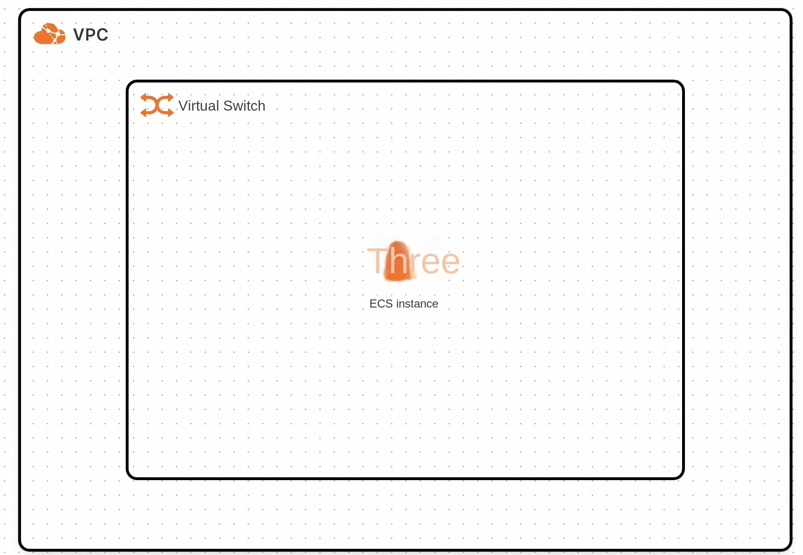
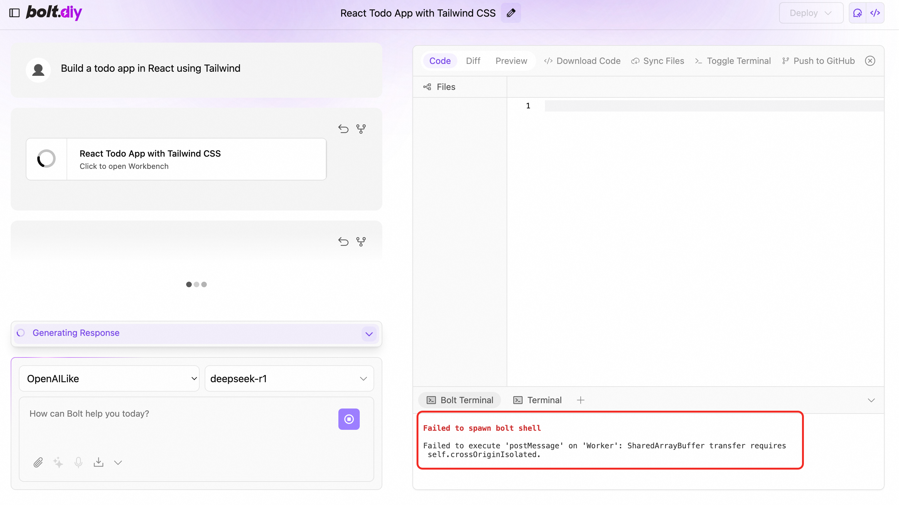

# Bolt.Diy Service Instance Deployment Documentation

## Overview

Bolt.diy is the official open source version of Bolt.new, an AI-driven Web development agent that supports writing Prompt, running, editing, and deploying full-stack applications directly from the browser without local setup. Bolt.diy has the following advantages
-Supports multiple large models including OpenAI, Anthropic, Ollama, OpenRouter, Gemini, LMStudio, Mistral, xAI, HuggingFace, DeepSeek, OpenAILike, etc.
-Support to restore code to previous version
-Support adding pictures in Prompt
-Support to download projects to local
-Support for Docker rapid deployment
-Support integrated terminal for easy page debugging
-Active community support

## Billing Description

The cost of Bolt.diy in calculating the nest mainly involves:

-Selected vCPU and memory specifications
-System disk type and capacity
-public network bandwidth

Billing methods include:

-Pay-As-You-Go (hours)
-Package year and package month

Refined model call cost:
When you open the 100-year-old for the first time, the platform will automatically issue you the exclusive free quota for new people of each model. For details, please see [100-year-old free quota](https://help.aliyun.com/zh/model-studio/new-free-quota?spm = 5176.24779694.console-# view-quota).

## Deployment Architecture
The deployment architecture adopts ECS (cloud server) stand-alone deployment
'(Deployment overview content)'

## Deployment process

### Deployment steps
1. Visit the computing nest Bolt.diy Community Edition [Deployment Link](https://computenest.console.aliyun.com/user/cn-hangzhou/serviceInstanceCreate?ServiceId=service-21dc43d5daec42c4b6fc)
Enter the deployment parameters as prompted, and configure the ECS instance type and password.

2. Configure the VPC and zone

3. Configure the Bailian model service. Bolt.diy supports a variety of large models. If you want to use the Bailian model service, configure the Bailian model service API-KEY. Please refer to: [Get Refined API-KEY](https://developer.aliyun.com/article/1655158?spm = 5176.24779694.0.0.5 c4b4d22bk6NwY).

### Validation Results

1. View the service instance. After the service instance is created successfully, the deployment time takes about 2 minutes. After the deployment is complete, the corresponding service instance is displayed on the page.
2. Access Bolt.diy through the service instance. After entering the corresponding service instance, you can obtain the access address on the page. Note: Bolt.diy page loads slowly, please wait patiently.

### Instructions for use

#### Configure your browser's security policy
If the process of using Bolt.diy, the page has the following error,

This is due to the browser's security policy restrictions on the SharedArrayBuffer. For security reasons, the browser requires that pages that use SharedArrayBuffer or multi-thread communication (such as postMessage transmission SharedArrayBuffer) must meet the Cross-Origin Isolation conditions, such
The loading protocol of the page is HTTPS (or localhost development environment). To get around this restriction, you can modify the browser's settings.
1. In the Chrome browser, access the flags page: enter chrome:// flags/#allow-insecure-localhost in the address bar.
2. Enable configuration: Set the option of Insecure origins treated as secure to Enabled, and add the access address of Bolt.diy in the input box below.

3. After modifying the configuration, restart the browser.

'''

The core effect of modifying this configuration is to allow HTTP resources to be treated as HTTPS, treating the specified Unsecure Origin (HTTP) as a secure HTTPS origin, and thus
1. Bypass Mixed Content warning:
When a web page is loaded via HTTPS, if it references HTTP protocol resources (such as pictures, scripts, API interfaces, etc.), the browser will block these resources by default and report an error (such as Mixed Content error). When this configuration is turned on, the specified HTTP origin is considered safe, allowing loading.
2. Support functions that require HTTPS:
Some web APIs (such as Fetch APIs, WebAuthn, WebSockets, etc.) may not be available in the HTTP environment, but with this setting, the specified HTTP origin can bypass this restriction.
'''

#### Configure the model using Refined
Premise: The API-KEY has been configured at the time of deployment.
1. Open the sidebar and click Settings in the lower left corner

2. Click "Local Providers" in Settings"

3. Turn on the "OpenAILike" switch

4. Select OpenAILike on the home page to use the large model service on Bailian.

Demo official website to learn how to use: [use documents](https://www.aliyun.com)
'''

