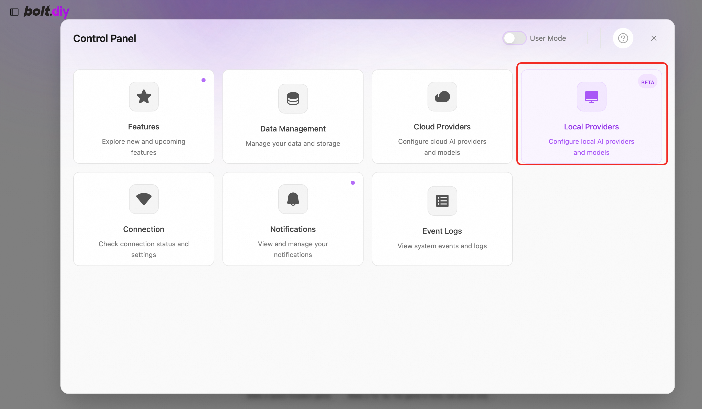

# Bolt.Diy Service Instance Deployment Documentation

## Overview

Bolt.diy is the official open source version of Bolt.new, an AI-driven Web development agent that supports writing Prompt, running, editing, and deploying full-stack applications directly from the browser without local setup. Bolt.diy has the following advantages
-Supports multiple large models including OpenAI, Anthropic, Ollama, OpenRouter, Gemini, LMStudio, Mistral, xAI, HuggingFace, DeepSeek, OpenAILike, etc.
-Support to restore code to previous version
-Support adding pictures in Prompt
-Support to download projects to local
-Support for Docker rapid deployment
-Support integrated terminal for easy page debugging
-Active community support

## Billing Description

The cost of Bolt.diy in calculating the nest mainly involves:

-Selected vCPU and memory specifications
-System disk type and capacity
-public network bandwidth

Billing methods include:

-Pay-As-You-Go (hours)
-Package year and package month

Refined model call cost:
When you open the 100-year-old for the first time, the platform will automatically issue you the exclusive free quota for new people of each model. For details, please see [100-year-old free quota](https://help.aliyun.com/zh/model-studio/new-free-quota?spm = 5176.24779694.console-# view-quota).

## Deployment Architecture
The deployment architecture adopts ECS (cloud server) stand-alone deployment
'(Deployment overview content)'

## Deployment process

### Deployment steps
1. Visit the computing nest Bolt.diy Community Edition [Deployment Link](https://computenest.console.aliyun.com/user/cn-hangzhou/serviceInstanceCreate?ServiceId=service-21dc43d5daec42c4b6fc)
Enter the deployment parameters as prompted, and configure the ECS instance type and password.

2. Configure the VPC and zone

3. Configure the Bailian model service. Bolt.diy supports a variety of large models. If you want to use the Bailian model service, configure the Bailian model service API-KEY. Please refer to: [Get Refined API-KEY](https://developer.aliyun.com/article/1655158?spm = 5176.24779694.0.0.5 c4b4d22bk6NwY).

### Validation Results

1. View the service instance. After the service instance is created successfully, the deployment time takes about 2 minutes. After the deployment is complete, the corresponding service instance is displayed on the page.
2. Access Bolt.diy through the service instance. After entering the corresponding service instance, you can obtain the access address on the page. Note: Bolt.diy page loads slowly, please wait patiently.

### Instructions for use

#### Configure the model using Refined
Premise: The API-KEY has been configured at the time of deployment.
1. Open the sidebar and click Settings in the lower left corner

2. Click "Local Providers" in Settings"

3. Turn on the "OpenAILike" switch

4. Select OpenAILike on the home page to use the large model service on Bailian.

Demo official website to learn how to use: [use documents](https://www.aliyun.com)
'''

