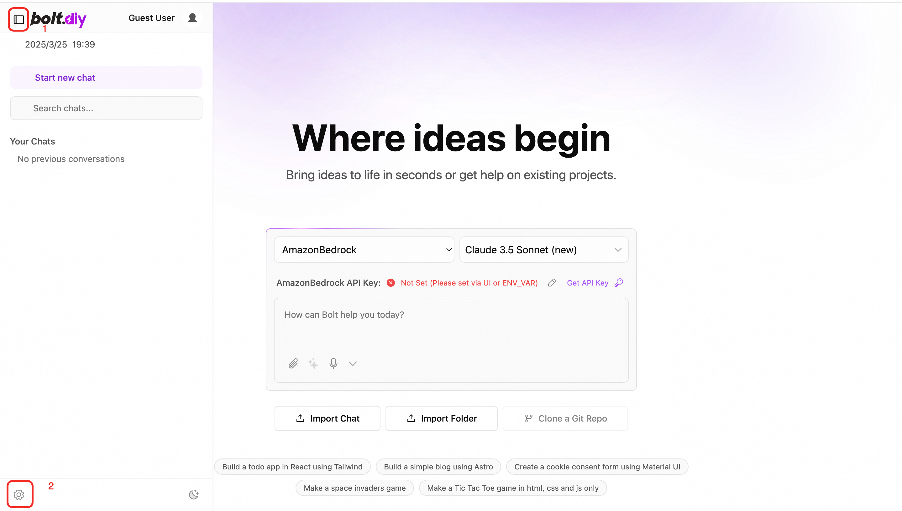
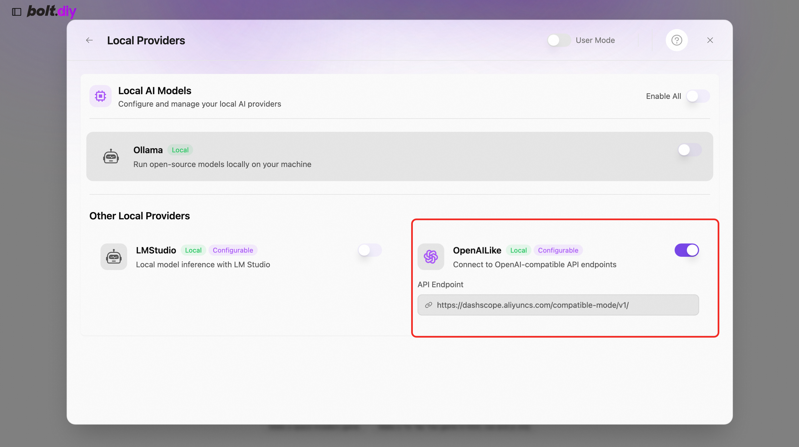

# Bolt.Diy服务实例部署文档

## 概述

Bolt.diy是 Bolt.new 的官方开源版本，Bolt.new是一个AI驱动的Web开发Agent, 支持直接从浏览器编写Prompt，运行，编辑和部署全栈应用程序, 而无需本地设置。Bolt.diy有以下优势
- 支持多种大模型，包括OpenAI， Anthropic, Ollama, OpenRouter, Gemini, LMStudio, Mistral, xAI, HuggingFace， DeepSeek、OpenAILike等。
- 支持将代码恢复到以前的版本
- 支持在Prompt中添加图片
- 支持将项目下载到本地
- 支持Docker快速部署
- 支持集成的terminal,方便页面调试
- 有活跃的社区支持

## 计费说明

Bolt.diy在计算巢上的费用主要涉及：

- 所选vCPU与内存规格
- 系统盘类型及容量
- 公网带宽

计费方式包括：

- 按量付费（小时）
- 包年包月

百炼模型调用费用:
当您首次开通百炼时，平台会自动为您发放各模型的新人专属免费额度，详情请看[百炼新人免费额度](https://help.aliyun.com/zh/model-studio/new-free-quota?spm=5176.24779694.console-base_help.dexternal.6ab44d22erpR17#view-quota)。


## 部署架构
部署架构采用ECS(云服务器)单机部署
`(部署概述内容)`

## 部署流程

### 部署步骤
1. 访问计算巢Bolt.diy社区版[部署链接](https://computenest.console.aliyun.com/user/cn-hangzhou/serviceInstanceCreate?ServiceId=service-21dc43d5daec42c4b6fc)
按提示填写部署参数,配置ECS实例规格和密码
   
2. 配置专有网络和可用区

3. 配置百炼模型服务，Bolt.diy支持多种大模型，如果想使用百炼的模型服务，请配置百炼模型服务的API-KEY。请参考： [获取百炼API-KEY](https://developer.aliyun.com/article/1655158?spm=5176.24779694.0.0.5c4b4d22bk6NwY)。

### 验证结果

1. 查看服务实例。服务实例创建成功后，部署时间大约需要2分钟。部署完成后，页面上可以看到对应的服务实例。 
2. 通过服务实例访问Bolt.diy。进入到对应的服务实例后，可以在页面上获取到访问地址，注意：Bolt.diy页面加载较慢，请耐心等待。

### 使用说明

#### 配置浏览器的安全策略
如果使用Bolt.diy的过程中，页面有如下报错,

这是由于浏览器对 SharedArrayBuffer 的安全策略限制导致的，浏览器出于安全考虑，要求使用 SharedArrayBuffer 或多线程通信（如 postMessage 传输 SharedArrayBuffer）的页面必须满足 Cross-Origin Isolation 条件，比如
页面的加载协议为 HTTPS（或 localhost 的开发环境）。为了绕开此限制，可以通过修改浏览器的设置。
1. 在Chrome浏览器中，访问标志页：在地址栏输入 chrome://flags/#allow-insecure-localhost。
2. 启用配置：将 Insecure origins treated as secure 的选项设为 Enabled， 在下方输入框中添加Bolt.diy的访问地址

3. 修改完配置后，重新启动浏览器即可。

```

修改此配置的核心效果是允许将 HTTP 资源视为 HTTPS，会将指定的不安全起源（HTTP） 视为安全的 HTTPS 起源，从而
1.绕过混合内容（Mixed Content）警告：
  当网页通过 HTTPS 加载时，如果它引用了 HTTP 协议的资源（如图片、脚本、API 接口等），浏览器会默认阻止这些资源并报错（如 Mixed Content 错误）。开启此配置后，指定的 HTTP 起源会被视为安全，从而允许加载。
2.支持需要 HTTPS 的功能：
  部分 Web API（如 Fetch API、WebAuthn、WebSockets 等）在 HTTP 环境下可能无法使用，但通过此设置，指定的 HTTP 起源可以绕过这一限制。
```

#### 配置使用百炼的模型
前提：在部署时已经配置过了百炼的API-KEY
1. 打开侧边栏，点击左下角的设置

2. 设置中点击"Local Providers"

3. 打开"OpenAILike"的开关

4. 在首页选择OpenAILike，即可使用百炼上的大模型服务

Demo官网了解如何使用：[使用文档](https://www.aliyun.com)
```


